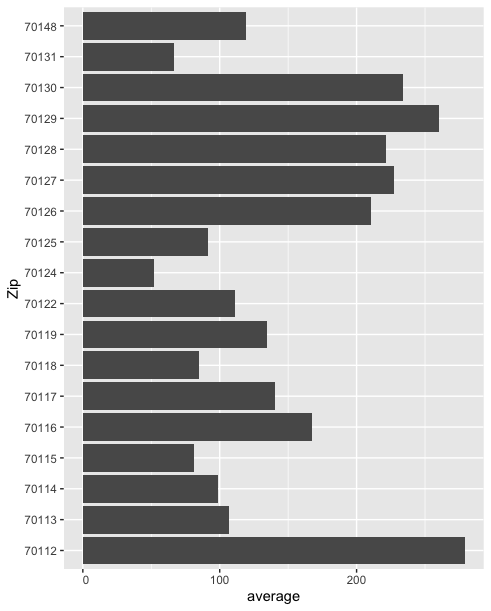

# Effect of blah on Blah
## By Brian Walsh
### MEA 3290, Spring 2021



|word        |  n| value|
|:-----------|--:|-----:|
|crisis      |  2|    -3|
|warning     |  2|    -3|
|worse       |  2|    -3|
|advantage   |  1|     2|
|care        |  1|     2|
|cry         |  1|    -1|
|death       |  1|    -2|
|devastating |  1|    -2|
|difficult   |  1|    -1|


<div class='tableauPlaceholder' id='viz1620144969788' style='position: relative'><noscript><a href='#'></a></noscript><object class='tableauViz'  style='display:none;'><param name='host_url' value='https%3A%2F%2Fpublic.tableau.com%2F' /> <param name='embed_code_version' value='3' /> <param name='site_root' value='' /><param name='name' value='chicago-covid&#47;Sheet1' /><param name='tabs' value='no' /><param name='toolbar' value='yes' /><param name='static_image' value='https:&#47;&#47;public.tableau.com&#47;static&#47;images&#47;ch&#47;chicago-covid&#47;Sheet1&#47;1.png' /> <param name='animate_transition' value='yes' /><param name='display_static_image' value='yes' /><param name='display_spinner' value='yes' /><param name='display_overlay' value='yes' /><param name='display_count' value='yes' /><param name='language' value='en' /></object></div>   
<details style="display: none;">

 
 ``` {js, echo=FALSE}              
  var divElement = document.getElementById('viz1620144969788');                    
  var vizElement = divElement.getElementsByTagName('object')[0];                    
  vizElement.style.width='100%';vizElement.style.height=(divElement.offsetWidth*0.75)+'px';                    
  var scriptElement = document.createElement('script');                    
  scriptElement.src = 'https://public.tableau.com/javascripts/api/viz_v1.js';                    
  vizElement.parentNode.insertBefore(scriptElement, vizElement);              
```
</details>

You can use the [editor on GitHub](https://github.com/bwalsh5/github_pages_test3/edit/main/README.md) to maintain and preview the content for your website in Markdown files.

Whenever you commit to this repository, GitHub Pages will run [Jekyll](https://jekyllrb.com/) to rebuild the pages in your site, from the content in your Markdown files.

### Markdown

Markdown is a lightweight and easy-to-use syntax for styling your writing. It includes conventions for

```r

ggplot(babynames, aes(name, year) + geom_line()
```

For more details see [GitHub Flavored Markdown](https://guides.github.com/features/mastering-markdown/).

### Jekyll Themes

Your Pages site will use the layout and styles from the Jekyll theme you have selected in your [repository settings](https://github.com/bwalsh5/github_pages_test3/settings/pages). The name of this theme is saved in the Jekyll `_config.yml` configuration file.

### Support or Contact

Having trouble with Pages? Check out our [documentation](https://docs.github.com/categories/github-pages-basics/) or [contact support](https://support.github.com/contact) and we’ll help you sort it out.
